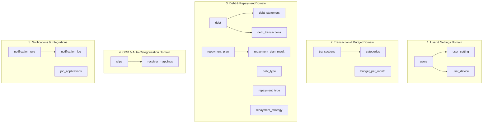

# 🗄️ FinanceCare Database Repository (financeCare_DB)

ระบบฐานข้อมูลหลักของโครงการ **FinanceCare** พัฒนาขึ้นโดยใช้ **PostgreSQL** เพื่อการจัดเก็บข้อมูลการเงินส่วนบุคคล การวางแผนจัดการหนี้สิน ประวัติการชำระเงิน การประมวลผล OCR สลิปโอนเงิน และการจัดการระบบสมาชิกอย่างปลอดภัยและมีประสิทธิภาพ

---

## ⚙️ ข้อมูลการเชื่อมต่อฐานข้อมูล (Database Connection Profile)

ในการพัฒนาและการติดตั้งระบบในสภาพแวดล้อมต่างๆ สามารถอ้างอิงข้อมูลการเชื่อมต่อเริ่มต้นดังนี้:

* **DBMS:** PostgreSQL (Dialect: `PostgreSQLDialect`)
* **Default Port:** `5432`
* **Database Name:** `financeCare_DB`
* **Default Username:** `root`
* **Default Password:** `password123`
* **Connection URL (Development):** `jdbc:postgresql://localhost:5432/financeCare_DB`
* **Hibernate DDL Auto-strategy:** `update`

---

## 🏗️ โครงสร้างความสัมพันธ์และการจัดกลุ่มตาราง (Database Architecture)

ระบบฐานข้อมูลประกอบด้วยตารางทั้งหมด **19 ตาราง** ซึ่งถูกแบ่งออกเป็น **5 โดเมนหลัก** ตามความรับผิดชอบและการทำงานของระบบ:



---

## 📊 รายการตารางทั้งหมดในระบบ (Tables Overview)

| ลำดับ | ชื่อตาราง | คำอธิบายหน้าที่การใช้งาน |
| :---: | :--- | :--- |
| **1** | `users` | จัดเก็บข้อมูลบัญชีผู้ใช้งานพื้นฐาน (Master User) เช่น รหัสผ่าน อีเมล และโทเคน |
| **2** | `user_setting` | จัดเก็บรายละเอียดการตั้งค่าส่วนบุคคลของผู้ใช้ การเปิด/ปิดแจ้งเตือน และโซนเวลา |
| **3** | `user_device` | บันทึกข้อมูลอุปกรณ์เคลื่อนที่ของสมาชิก พร้อม FCM Token สำหรับแจ้งเตือนแบบ Push |
| **4** | `budget_per_month` | จัดเก็บข้อมูลยอดเงินงบประมาณและเพดานจำกัดค่าใช้จ่ายที่ผู้ใช้ตั้งไว้ในแต่ละเดือน |
| **5** | `categories` | ตารางข้อมูลหมวดหมู่ทางการเงิน (Master Data) ทั้งฝั่งรายรับ (Income) และรายจ่าย (Expense) |
| **6** | `transactions` | เก็บบันทึกประวัติการทำธุรกรรมรายรับ-รายจ่ายทั่วไปของผู้ใช้งาน |
| **7** | `slips` | ข้อมูลรายละเอียดสลิปการโอนเงินธนาคารที่สกัดและคัดกรองข้อมูลด้วย EasyOCR |
| **8** | `receiver_mappings` | ข้อมูลการเรียนรู้จดจำชื่อผู้รับโอนเงินในสลิปกับหมวดหมู่ เพื่อใช้แยกประเภทรายจ่ายอัตโนมัติ |
| **9** | `job_applications` | จัดเก็บประวัติการบันทึกความสนใจงานหรือการสมัครอาชีพเสริมผ่านการแนะนำของระบบ |
| **10** | `debt` | ข้อมูลรายละเอียดหนี้สินของผู้ใช้แต่ละก้อน เช่น เงินต้น ดอกเบี้ย และยอดจ่ายขั้นต่ำ |
| **11** | `debt_statement` | บันทึกยอดคงเหลือและดอกเบี้ยของหนี้แต่ละก้อนแยกเป็นรายเดือน (Monthly Snapshot) |
| **12** | `debt_transactions` | ประวัติการชำระเงินต้น ดอกเบี้ย และค่าปรับของหนี้สินแต่ละรายการ |
| **13** | `debt_type` | ประเภทของหนี้สิน (Master Data) เช่น บัตรเครดิต, สินเชื่อส่วนบุคคล, หนี้บ้าน, หนี้รถ |
| **14** | `repayment_type` | รูปแบบการคิดอัตราดอกเบี้ยและผ่อนชำระ (Master Data) เช่น ลดต้นลดดอก (Effective Rate) หรือคงที่ |
| **15** | `repayment_plan` | แผนกลยุทธ์การชำระหนี้รวมที่ผู้ใช้งานสร้างขึ้นเพื่อเข้าสู่ระบบจำลองการผ่อนชำระ |
| **16** | `repayment_plan_result` | ผลลัพธ์ข้อมูลจำลองยอดหนี้คงเหลือและดอกเบี้ยแต่ละเดือนที่จะเกิดขึ้นจริงตามแผน |
| **17** | `repayment_strategy` | กลยุทธ์ที่ใช้ปลดหนี้ (Master Data) ได้แก่ Debt Avalanche และ Debt Snowball |
| **18** | `notification_rule` | เงื่อนไขและกฎการแจ้งเตือนที่ผู้ใช้ตั้งขึ้น เช่น แจ้งล่วงหน้ากี่วัน หรือมีเนื้อหาอย่างไร |
| **19** | `notification_log` | ประวัติและสถานะการส่งข้อความแจ้งเตือนหาผู้ใช้ผ่านทาง Push หรือ Email |

---

## 📖 พจนานุกรมข้อมูลรายละเอียดตารางหลัก (Detailed Data Dictionary)

โครงสร้างคอลัมน์ของตารางข้อมูลที่สำคัญในการดำเนินงานของแอปพลิเคชัน:

### 1. ตาราง: `users`
*คำอธิบาย: ตารางเก็บข้อมูลบัญชีผู้ใช้งานพื้นฐาน*
* **`user_id`** (UUID, **PK**): รหัสอ้างอิงเฉพาะของผู้ใช้งาน
* **`username`** (VARCHAR(255)): ชื่อบัญชีผู้ใช้งาน
* **`password_hash`** (VARCHAR(255)): รหัสผ่านที่เข้ารหัสผ่านระบบความปลอดภัย
* **`dob`** (DATE): วันเกิดของผู้ใช้
* **`email`** (VARCHAR(255), **UNIQUE, NOT NULL**): อีเมลอ้างอิงในการลงทะเบียนและรับแจ้งเตือน
* **`email_confirm`** (BOOLEAN): สถานะผ่านการยืนยันอีเมลแล้วหรือยัง
* **`refresh_token`** (VARCHAR(255)): โทเคนในการยืนยันสิทธิ์เข้าถึงเพื่อต่ออายุ Session (JWT)

### 2. ตาราง: `debt`
*คำอธิบาย: ตารางเก็บรายละเอียดหนี้สินของผู้ใช้แต่ละรายการ*
* **`debt_id`** (UUID, **PK**): รหัสรายการหนี้สิน
* **`user_id`** (UUID, **FK -> users**): รหัสสมาชิกเจ้าของรายการหนี้
* **`repayment_type`** (INTEGER, **FK -> repayment_type**): รหัสการคิดดอกเบี้ยผ่อนชำระ
* **`debt_type`** (INTEGER, **FK -> debt_type**): รหัสประเภทหนี้
* **`debt_name`** (VARCHAR(255)): ชื่อหนี้สิน/สถาบันการเงินที่เกี่ยวข้อง
* **`principal_amount`** (DECIMAL(15,2)): ยอดเงินต้นดั้งเดิมตอนสร้างหนี้
* **`interest_rate`** (DECIMAL(10,4)): อัตราดอกเบี้ยต่อปี (%)
* **`min_payment`** (DECIMAL(15,2)): ยอดที่ระบุต้องชำระขั้นต่ำในรอบเดือน
* **`principal_outstanding`** (DECIMAL(15,2)): ยอดเงินต้นคงเหลือจริง ณ ปัจจุบัน
* **`is_active`** (BOOLEAN): สถานะหนี้ (true = ยังอยู่ระหว่างผ่อนชำระ, false = ปิดยอดหนี้เรียบร้อย)

### 3. ตาราง: `transactions`
*คำอธิบาย: ตารางบันทึกรายการธุรกรรมการเงินทั่วไปรายวัน*
* **`transaction_id`** (UUID, **PK**): รหัสอ้างอิงรายการธุรกรรม
* **`user_id`** (UUID, **FK -> users**): รหัสเจ้าของธุรกรรม
* **`category_id`** (INTEGER, **FK -> categories**): รหัสหมวดหมู่รายรับ/จ่าย
* **`amount`** (DECIMAL(15,2)): ยอดจำนวนเงินในรายการ
* **`transaction_date`** (TIMESTAMP): วันและเวลาที่ทำรายการจริง
* **`description`** (VARCHAR(128)): บันทึกข้อความสั้นช่วยเตือนความจำ
* **`slip_id`** (BIGINT, **FK -> slips**): รหัสสลิปที่เกี่ยวข้องในกรณีมาจากการสแกน OCR

### 4. ตาราง: `slips`
*คำอธิบาย: ตารางเก็บข้อมูลผลการสกัดรายละเอียดสลิปโอนเงินผ่านระบบ EasyOCR*
* **`id`** (BIGINT, **PK**): รหัสสลิปโอนเงิน
* **`user_id`** (UUID, **FK -> users**): รหัสสมาชิกผู้อัปโหลดสลิป
* **`sender_bank`** (VARCHAR(255)): ชื่อธนาคารผู้ให้บริการฝั่งโอนเงิน
* **`receiver_name`** (VARCHAR(255)): ชื่อเต็มของบุคคล/ร้านค้าปลายทางที่รับเงิน
* **`amount`** (DECIMAL(15,2)): ยอดจำนวนเงินโอนในสลิป
* **`transfer_date`** (TIMESTAMP): วันและเวลาที่ทำธุรกรรมโอนเงินในสลิป
* **`image_path`** (VARCHAR(500)): ที่อยู่พาทจัดเก็บรูปภาพในระบบ MinIO Object Storage
* **`raw_texts`** (JSONB): ข้อมูลข้อความดิบทั้งหมดที่แกะจากภาพด้วย EasyOCR สำหรับนำไปสกัดต่อ

---

## 💾 การจัดการฐานข้อมูลและการทำสำรองข้อมูล (Backup & Restore Operations)

คุณสามารถจัดการระบบฐานข้อมูล PostgreSQL ของคุณผ่านบรรทัดคำสั่ง (CLI) ได้ดังนี้:

### 1. การสำรองข้อมูลทั้งหมด (Backup / Database Dump)
คำสั่งสำหรับส่งออกโครงสร้างฐานข้อมูลและข้อมูลดิบทั้งหมดไปยังไฟล์ `.sql`:
```bash
pg_dump -h localhost -p 5432 -U root -d financeCare_DB -F p -b -v -f database_backup.sql
```

### 2. การนำเข้าข้อมูลกลับเข้าระบบ (Restore Data)
คำสั่งสำหรับเขียนทับหรือป้อนข้อมูลจากไฟล์สำรองกลับไปยัง PostgreSQL:
```bash
psql -h localhost -p 5432 -U root -d financeCare_DB -f database_backup.sql
```

### 3. การใช้งานฐานข้อมูลร่วมกับ Docker Compose
หากใช้งานร่วมกับ Service `postgres-db` ใน `docker-compose.yml` ของระบบหลังบ้าน:
* ตรวจสอบให้แน่ใจว่าได้สร้าง Docker Network ภายนอกแล้ว:
  ```bash
  docker network create finance-net
  ```
* เมื่อรัน Docker Compose ขึ้นมา ฐานข้อมูลจะถูกสร้างและเชื่อมโยงกับ Container อื่นๆ โดยอัตโนมัติ และจะเก็บข้อมูลแบบถาวรผ่าน Docker Volume เพื่อไม่ให้ข้อมูลสูญหายเมื่อหยุดทำงาน

---

*ดูแลและจัดการโครงสร้างฐานข้อมูลของระบบ FinanceCare เพื่อสุขภาพทางการเงินและอนาคตที่ดีของผู้ใช้งาน 🗄️*
